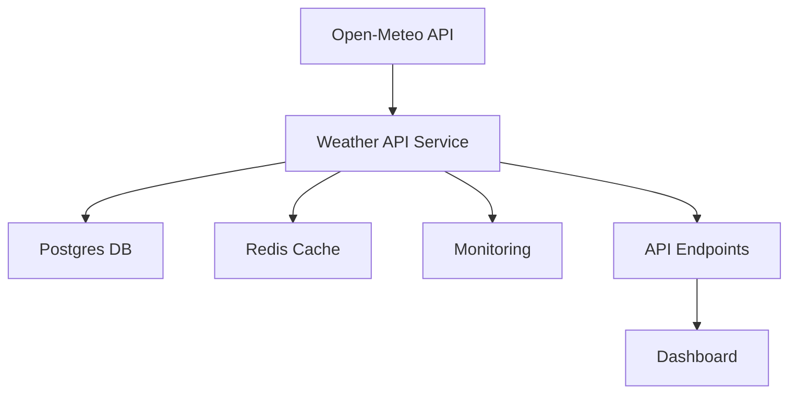

# Poland Weather Data Lake (SOTA Edition)


A state-of-the-art, production-grade weather data pipeline for Polish cities. Built for data engineering portfolio showcase.

---

## Features
- Real-time weather ingestion from Open-Meteo API
- Multi-tier storage: raw, curated, analytics
- Automated data validation and error handling
- Monitoring endpoints and logging
- Docker Compose for local development
- CI/CD pipeline (GitHub Actions)
- Unit and integration tests
- API documentation and examples

---

## Architecture



---

## Quick Start

### Local Development
```bash
# Start all services
docker-compose up --build
# Access API at http://localhost:3003/api/current?city=warsaw
```

### Run Tests
```bash
npm test
```

---

## API Endpoints
| Endpoint                | Method | Description                  |
|------------------------|--------|------------------------------|
| /api/current?city=NAME | GET    | Current weather for a city   |
| /api/hourly?city=NAME  | GET    | Hourly forecast              |
| /api/daily?city=NAME   | GET    | Daily forecast               |
| /health                | GET    | Pipeline health/status       |

---

## Data Validation & Monitoring
- All incoming data is validated for schema and value ranges
- Monitoring endpoint `/health` provides pipeline status
- Errors and anomalies are logged and reported

---

## Testing Strategy
- Unit tests for core logic
- Integration tests for API endpoints
- Data validation tests (Great Expectations)
- CI/CD runs all tests on every push

---

## Deployment
- Docker Compose for local and cloud deployment
- GitHub Actions for CI/CD
- Ready for cloud migration (AWS/GCP/Azure)

---

## Portfolio Value
This project demonstrates:
- Modern data engineering practices
- Automated testing and deployment
- Robust error handling and monitoring
- Clean, documented codebase

---

## License
MIT