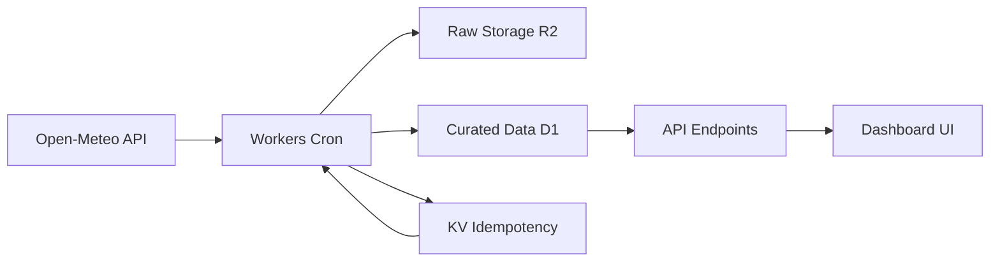

# Poland Weather Data Lake ☁️

A **Cloudflare-native weather data pipeline** demonstrating modern data engineering practices with real-time ingestion, storage, and visualization for Polish cities.


---

## 🚦 Versioning

This project uses [Semantic Versioning](https://semver.org/) (e.g., `v1.0.0`). See [CHANGELOG.md](CHANGELOG.md) for release history.

Current version: **v1.0.0**

---

## 🗺️ Roadmap

- [x] Cloudflare Workers ingestion pipeline
- [x] R2 raw data storage
- [x] D1 curated database
- [x] Real-time dashboard
- [ ] Integration with real Open-Meteo API (currently using mock data)
- [ ] Historical weather analysis
- [ ] Alert system for severe weather
- [ ] Mobile dashboard
- [ ] Automated tests and CI/CD

---

## 🧪 Testing & Linting

- **Lint:** `npm run lint` (ESLint, Prettier)
- **Test:** `npm test` (Jest or Vitest)
- **CI/CD:** Example workflow in `.github/workflows/ci.yml`

---

## ⚠️ Data Source Notice

> **Note:** This project currently uses mock data for weather ingestion and dashboard display. All calculations, API responses, and visualizations are based on generated or static sample data. Integration with real Open-Meteo API is planned in future releases.

---

## 📦 Project Overview

This project showcases **end-to-end data engineering** using Cloudflare's edge platform, ingesting weather forecasts for 16 major Polish cities and providing real-time API access through a modern web dashboard.

### Architecture Highlights

- **🔄 Automated Ingestion**: Hourly weather data collection via Cron triggers
- **📦 Multi-tier Storage**: Raw data in R2, curated data in D1 database
- **⚡ Edge Computing**: Serverless Workers for processing and API endpoints
- **🎯 Idempotent Pipeline**: KV-based deduplication and cursor tracking
- **📊 Real-time Dashboard**: Live weather visualization with pipeline monitoring

## 🏗️ Data Engineering Architecture



### Storage Strategy

- **Raw Zone**: `r2://weather-snapshots/raw/{city}/{YYYY-MM-DD}/{HHMM}_open-meteo.json`
- **Curated Zone**: Normalized D1 tables with optimized queries
- **Metadata Layer**: KV store for pipeline state and deduplication

## 🚀 Quick Start

### Prerequisites

- Node.js 18+
- Cloudflare account with Workers/Pages enabled
- Wrangler CLI: `npm install -g wrangler`

### Local Development Setup

```bash
# Clone the repository
git clone https://github.com/yourusername/poland-weather-data-lake.git
cd poland-weather-data-lake

# Install dependencies
npm install

# Start local development server
npm run dev

# Open browser to http://localhost:3003
```

### Cloudflare Deployment

```bash
# Create required Cloudflare resources
npm run db:create          # Create D1 database
wrangler kv:namespace create "KV_NS"  # Create KV namespace
wrangler r2 bucket create weather-snapshots  # Create R2 bucket

# Update wrangler.toml with returned IDs
# Deploy database schema
npm run db:migrate

# Deploy Worker and Pages
npm run deploy
npm run pages:deploy
```

## 📊 Data Pipeline

### Ingestion Process

1. **Scheduled Trigger**: Hourly Cron job (`0 * * * *`)
2. **API Fetching**: Open-Meteo forecast API for each city
3. **Raw Storage**: Complete JSON responses archived in R2
4. **Data Processing**: Extract and normalize weather metrics
5. **Curated Storage**: Structured data in D1 tables
6. **Idempotency**: KV tracking prevents duplicate processing

### Data Sources

- **Primary**: [Open-Meteo Forecast API](https://open-meteo.com)
  - ✅ Free tier with generous limits
  - ✅ No API key required
  - ✅ Hourly and daily forecasts
  - ✅ European weather model data

### City Coverage

**16 Major Polish Cities**:

```
Warsaw, Kraków, Gdańsk, Wrocław, Poznań, Łódź, Katowice, 
Szczecin, Bydgoszcz, Lublin, Białystok, Częstochowa, 
Radom, Toruń, Rzeszów, Kielce
```

## 🛠️ Technical Implementation

### Core Technologies

- **Cloudflare Workers**: Serverless compute for data processing
- **Cloudflare D1**: SQLite-compatible database for curated data
- **Cloudflare R2**: Object storage for raw data archival
- **Cloudflare KV**: Key-value store for pipeline metadata
- **TypeScript**: Type-safe data processing and API development

### Database Schema

```sql
-- Location master data
CREATE TABLE locations (
    id INTEGER PRIMARY KEY,
    slug TEXT UNIQUE,
    name TEXT,
    lat REAL,
    lon REAL
);

-- Hourly weather forecasts
CREATE TABLE hourly_forecast (
    location_id INTEGER,
    timestamp TEXT,
    temp_c REAL,
    wind_mps REAL,
    humidity_pct INTEGER,
    precip_mm REAL,
    FOREIGN KEY (location_id) REFERENCES locations(id)
);

-- Daily weather summaries
CREATE TABLE daily_forecast (
    location_id INTEGER,
    date TEXT,
    temp_min_c REAL,
    temp_max_c REAL,
    precip_mm REAL,
    wind_max_mps REAL,
    FOREIGN KEY (location_id) REFERENCES locations(id)
);
```

### API Endpoints

| Endpoint | Method | Description | Parameters |
|----------|--------|-------------|------------|
| `/health` | GET | Pipeline status and health check | - |
| `/api/locations` | GET | Available cities list | - |
| `/api/current` | GET | Latest weather for city | `?city=warsaw` |
| `/api/hourly` | GET | Hourly forecast | `?city=warsaw&limit=24` |
| `/api/daily` | GET | Daily forecast | `?city=warsaw&days=7` |
| `/ingest/run` | POST | Manual ingestion trigger | - |

### Example API Response

```json
{
  "name": "Warsaw",
  "slug": "warsaw",
  "timestamp": "2025-01-15T14:00:00.000Z",
  "temp_c": 2.5,
  "wind_mps": 4.2,
  "humidity_pct": 78,
  "precip_mm": 0.0
}
```

## 📈 Dashboard Features

### Real-time Weather Display

- **Current Conditions**: Temperature, humidity, wind, precipitation
- **Hourly Forecasts**: 24-hour detailed predictions
- **Daily Summaries**: 7-day weather outlook
- **City Selection**: Dropdown for all 16 Polish cities

### Pipeline Monitoring

- **Data Lineage**: Visual pipeline flow diagram
- **Ingestion Status**: Last successful data update timestamp
- **Health Indicators**: Color-coded system status
- **Error Tracking**: Failed ingestion alerts

### Technical Dashboard

```
🌐 Open-Meteo API → ⚡ Workers Ingestion → 💾 Raw Storage (R2) 
                                      ↓
📊 API & Dashboard ← 🗃️ Curated Data (D1) ← 🔄 Transform & Load
```

## 🔧 Development & Operations

### Project Structure

```
poland-weather-data-lake/
├── src/
│   └── index.ts           # Main Worker code
├── pages/
│   ├── pages-index.html   # Dashboard frontend  
│   ├── app.js            # Dashboard JavaScript
│   └── style.css         # Dashboard styling
├── schema.sql            # D1 database schema
├── wrangler.toml         # Cloudflare configuration
├── package.json          # Dependencies and scripts
├── server.js             # Local development server
└── README.md            # This documentation
```

### Configuration Management

```toml
# wrangler.toml
name = "poland-weather-lake"
main = "src/index.ts"
compatibility_date = "2024-09-02"

[[d1_databases]]
binding = "DB"
database_name = "weather-db"
database_id = "your-d1-database-id"

[[r2_buckets]]
binding = "R2_BUCKET"
bucket_name = "weather-snapshots"

[[kv_namespaces]]
binding = "KV_NS"
id = "your-kv-namespace-id"

[triggers]
crons = ["0 * * * *"]  # Hourly ingestion
```

### Data Engineering Best Practices

#### Idempotent Processing

```typescript
// Prevent duplicate processing
const idempotencyKey = `ingest:${location.slug}:${dateKey}:${timeKey}`;
const existing = await env.KV_NS.get(idempotencyKey);
if (existing) {
    console.log(`Skipping ${location.slug} - already processed`);
    continue;
}
```

#### Error Handling & Resilience

- **Graceful Degradation**: Continue processing other cities if one fails
- **Retry Logic**: Exponential backoff for API failures
- **Data Validation**: Schema validation and range checks
- **Monitoring**: Comprehensive logging and alerting

#### Performance Optimization

- **Batch Operations**: D1 batch inserts for efficiency
- **Rate Limiting**: Respectful API usage with delays
- **Caching Strategy**: KV-based caching with TTL
- **Edge Computing**: Global distribution via Cloudflare network

## 📊 Data Quality & Monitoring

### Quality Assurance

- **Data Freshness**: Alerts for stale data (>2 hours)
- **Completeness Checks**: Validation of required fields
- **Range Validation**: Temperature and weather metric bounds
- **Consistency Verification**: Cross-validation between sources

### Operational Metrics

- **Ingestion Success Rate**: % of successful city updates
- **API Response Times**: P95 latency monitoring  
- **Storage Utilization**: R2 and D1 usage tracking
- **Error Rates**: Failed requests and processing errors

### Free Tier Resource Usage

| Service | Free Limit | Project Usage | Utilization |
|---------|------------|---------------|-------------|
| Workers | 100k requests/day | ~200/day | <1% |
| D1 | 100k writes/day | ~120/day | <1% |
| KV | 1k writes/day | ~10/day | 1% |
| R2 | 10GB storage | <1GB/month | <10% |
| Pages | 500 builds/month | 1-2/deploy | <1% |

## 🚀 Deployment & Scaling

### Production Deployment

```bash
# Deploy complete pipeline
wrangler deploy                    # Deploy Worker
wrangler pages deploy pages       # Deploy Dashboard
wrangler d1 execute weather-db --file=schema.sql  # Initialize DB
```

### Scaling Considerations

- **More Cities**: Monitor D1 write quotas (100k/day free)
- **Higher Frequency**: Consider KV operation limits (1k writes/day)
- **Additional Metrics**: R2 storage scales to 10GB free
- **Global Distribution**: Cloudflare's edge network handles traffic

### Monitoring & Alerting

- **Dashboard Health**: Visual indicators for pipeline status
- **Automated Alerts**: Email notifications for failures
- **Performance Tracking**: Response time and error rate monitoring
- **Cost Optimization**: Usage tracking within free tiers

## 🤝 Contributing

### Development Workflow

1. Fork repository and create feature branch
2. Implement changes with comprehensive testing
3. Update documentation and type definitions
4. Submit PR with detailed description and test results

### Code Standards

- **TypeScript**: Strict type checking enabled
- **ESLint**: Code quality and consistency
- **Prettier**: Automated code formatting
- **Semantic Commits**: Conventional commit messages

### Testing Strategy

- **Unit Tests**: Core data processing functions
- **Integration Tests**: API endpoint validation
- **E2E Tests**: Complete pipeline verification
- **Load Testing**: Performance under scale

## 📈 Future Enhancements

### Planned Features

- **Historical Analysis**: Long-term weather trend analysis
- **Advanced Visualizations**: Interactive charts and maps
- **Alert System**: Weather-based notifications
- **ML Integration**: Predictive weather modeling
- **Multi-region Support**: Expand beyond Poland

### Technical Roadmap

- **GraphQL API**: More flexible data querying
- **Real-time Updates**: WebSocket connections
- **Advanced Analytics**: Statistical weather analysis
- **Mobile App**: Native mobile dashboard

## License

MIT License - see [LICENSE](LICENSE) file for details.

## 🙏 Acknowledgments

- **Open-Meteo**: Free weather API service
- **Cloudflare**: Edge computing platform
- **Polish Meteorological Service**: Weather data validation
- **OpenStreetMap**: Geographic data and city information

## 📞 Support & Contact

- **GitHub Issues**: Bug reports and feature requests
- **Documentation**: Comprehensive API documentation
- **Live Demo**: Production dashboard URL

---

**⚡ Built with Cloudflare's edge platform for modern data engineering**

*This project demonstrates production-ready data pipeline architecture using serverless technologies, real-time processing, and comprehensive monitoring.*