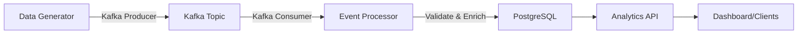

# Urban Mobility Real-Time Analytics Pipeline

[](https://github.com/JGITSol/data_SC_ENG_AI_projects/actions)

A production-grade, real-time data pipeline for urban mobility analytics. This project showcases **streaming data engineering** with Kafka, PostgreSQL, and FastAPI.


---

## 🎯 Project Overview

This project demonstrates **real-time stream processing** for urban mobility data (bikes, scooters, buses, trams). It implements a complete ETL pipeline with:

- **Real-time event streaming** via Apache Kafka
- **Data validation and enrichment** with custom processors  
- **PostgreSQL storage** with optimized schema
- **REST API** for analytics queries
- **Production-ready architecture** with Docker Compose

---

## 🏗️ Architecture



### Components

1. **Kafka Producer** (`src/kafka_producer.py`)
   - Generates realistic urban mobility events
   - Publishes to Kafka topic at configurable rate
   - Simulates multiple cities and vehicle types

2. **Kafka Consumer** (`src/kafka_consumer.py`)
   - Consumes events from Kafka
   - Validates data quality and business rules
   - Enriches events (speed, cost/km metrics)
   - Stores in PostgreSQL

3. **Analytics API** (`src/main.py`)
   - FastAPI REST endpoints
   - Real-time analytics queries
   - Filtering by city, vehicle type, time window

4 **Database Layer** (`src/database.py`)
   - SQLAlchemy ORM models
   - Optimized indexes for analytics queries

---

## 🚀 Quick Start

### Prerequisites

- Docker & Docker Compose
- Python 3.10+ (for local development)

### Running with Docker Compose

```bash
# Start all services (Kafka, PostgreSQL, API, Producer, Consumer)
cd data_engineering_2
docker-compose up --build

# Wait ~30 seconds for services to start
# Access API at http://localhost:8000
```

### API Endpoints

| Endpoint | Method | Description |
|----------|--------|-------------|
| `/health` | GET | Health check with database status |
| `/api/analytics` | GET | Analytics summary (trips, revenue, breakdowns) |
| `/api/recent-trips` | GET | Recent trip events with filters |
| `/api/stats` | GET | Overall system statistics |
| `/docs` | GET | Interactive API documentation |

### Example Queries

```bash
# Get analytics for last 24 hours
curl "http://localhost:8000/api/analytics?hours=24"

# Filter by city
curl "http://localhost:8000/api/analytics?city=Warsaw"

# Get recent trips
curl "http://localhost:8000/api/recent-trips?limit=50&vehicle_type=bike"
```

---

## 🧪 Testing

```bash
# Run all tests
pytest tests/ -v --cov=src

# Run with coverage report
pytest tests/ --cov=src --cov-report=html

# Run specific test file
pytest tests/test_kafka.py -v
```

### Test Coverage

- Unit tests for data generator
- Unit tests for event validation and enrichment
- Integration tests for API endpoints
- Mock-based tests for Kafka integration

---

## 📊 Features & Capabilities

### Data Generation
- Realistic urban mobility events (bikes, scooters, buses, trams, metro)
- Multiple Polish cities (Warsaw, Krakow, Gdansk, Wroclaw, Poznan)
- Weather conditions and time-based patterns
- Configurable event generation rate

### Data Validation
- Schema validation (required fields, types)
- Business rule validation (positive amounts, logical timestamps)
- Statistical anomaly detection
- Comprehensive logging of validation results

### Event Enrichment
- Average speed calculation (km/h)
- Cost per kilometer metrics
- Processing timestamps
- Weekend/weekday flags

### Analytics
- Real-time trip aggregations
- Revenue calculations
- Breakdown by vehicle type and city
- Time-window filtering (last N hours)
- Query filtering by city and vehicle type

---

## 🛠️ Tech Stack Highlights

| Technology | Purpose | Key Features |
|-----------|---------|--------------|
| **Apache Kafka** | Stream Processing | Event streaming, topic partitioning, at-least-once delivery |
| **FastAPI** | REST API | Auto-generated docs, Pydantic validation, async support |
| **PostgreSQL** | Data Storage | ACID compliance, optimized indexes, JSON support |
| **SQLAlchemy** | ORM | Type-safe models, query building, migrations-ready |
| **Docker Compose** | Orchestration | Multi-service deployment, networking, volumes |
| **pytest** | Testing | Mocking, fixtures, coverage reporting |

---

## 📁 Project Structure

```
data_engineering_2/
├── src/
│   ├── __init__.py
│   ├── main.py              # FastAPI application
│   ├── kafka_producer.py    # Event generator & producer
│   ├── kafka_consumer.py    # Consumer & processor
│   ├── database.py          # SQLAlchemy models
│   └── api.py              # (deprecated - merged into main)
├── tests/
│   ├── conftest.py
│   ├── test_kafka.py        # Kafka tests
│   ├── test_api.py          # API tests
│   └── test_health.py       # Health endpoint tests
├── .github/
│   └── workflows/
│       └── ci.yml           # CI/CD pipeline
├── docker-compose.yml       # Service orchestration
├── Dockerfile               # Application container
├── requirements.txt         # Python dependencies
├── pyproject.toml          # Project metadata
└── README.md

```

---

## 🚀 Deployment

### Local Development

```bash
# Install dependencies
pip install -r requirements.txt

# Run producer standalone
python -m src.kafka_producer --rate 10

# Run consumer standalone
python -m src.kafka_consumer

# Run API standalone
uvicorn src.main:app --reload
```

### Production Considerations

- **Kafka**: Use managed Kafka (Confluent Cloud, AWS MSK) or tune Kafka settings for production
- **Database**: Use managed PostgreSQL (AWS RDS, Google Cloud SQL) with read replicas
- **Monitoring**: Add Prometheus metrics and Grafana dashboards
- **Logging**: Centralize logs with ELK stack or cloud logging
- **Security**: Add authentication (JWT), API rate limiting, SSL/TLS

---

## 📈 Portfolio Value

This project demonstrates **advanced data engineering skills**:

✅ **Real-time streaming** with Kafka (producer/consumer patterns)  
✅ **Data quality** engineering (validation, enrichment)  
✅ **API design** with FastAPI (RESTful, documented)  
✅ **Database design** with indexes and optimizations  
✅ **Testing** (unit, integration, mocking)  
✅ **Docker & containerization** for reproducibility  
✅ **CI/CD** with GitHub Actions  
✅ **Production-ready** architecture and best practices

---

## 📝 License

MIT

---

## 🎓 Learning Outcomes

- Implementing real-time event streaming with Apache Kafka
- Building ETL pipelines with data validation
- Designing REST APIs for analytics workloads
- Testing streaming applications
- Containerizing multi-service applications
- Establishing CI/CD for data pipelines
