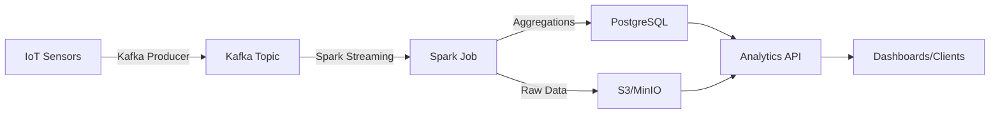

# Smart City Streaming Data Platform

[]()


Production-grade streaming data platform for smart city IoT sensors using **Apache Spark Structured Streaming**, Kafka, and cloud storage.

---

## 🎯 Overview

This project demonstrates **senior-level distributed streaming** with:

 - **Apache Spark Structured Streaming** - Windowed aggregations, watermarking
- **Apache Kafka** - Event ingestion from IoT sensors
- **S3/MinIO** - Partitioned data lake storage
- **PostgreSQL** - Aggregated analytics storage
- **FastAPI** - Query API for processed data

### Sensor Types

- **Air Quality**: PM2.5, PM10, NO2, CO2, temperature, humidity
- **Traffic**: Vehicle count, average speed, congestion levels
- **Parking**: Occupancy rates, available spots
- **Weather**: Temperature, pressure, wind speed, precipitation
- **Energy**: Power consumption, voltage, current, power factor

---

## 🏗️ Architecture



### Data Flow

1. **Sensor Simulator** generates realistic IoT events
2. **Kafka Producer** publishes to `smart-city-sensors` topic
3. **Spark Streaming** consumes, processes with windowed aggregations
4. **PostgreSQL** stores aggregated metrics (5-min windows)
5. **S3/MinIO** stores raw and aggregated data (partitioned by type/city/date)
6. **FastAPI** serves analytics queries

---

## 🚀 Quick Start

### Prerequisites

- Docker & Docker Compose
- Python 3.10+
- 8GB RAM minimum (for Spark)

### Running the Platform

```bash
cd data_engineering_4
docker-compose up --build

# Wait ~60 seconds for all services to start
# Access API at http://localhost:8000
```

### API Endpoints

| Endpoint | Description |
|----------|-------------|
| `GET /health` | Health check (DB + S3 status) |
| `POST /ingest` | Ingest sensor reading to S3 |
| `GET /query/air-quality` | Query air quality aggregations |
| `GET /query/traffic` | Query traffic aggregations |
| `GET /query/energy` | Query energy aggregations |
| `GET /storage/stats` | S3 bucket statistics |
| `GET /storage/list` | List stored objects |
| `GET /docs` | Interactive API docs |

### Example Queries

```bash
# Air quality for Warsaw in last 24h
curl "http://localhost:8000/query/air-quality?city=Warsaw&hours=24"

# Traffic data
curl "http://localhost:8000/query/traffic?hours=12&limit=50"

# Storage statistics
curl "http://localhost:8000/storage/stats"
```

---

## 📊 Tech Stack

| Technology | Purpose | Key Features |
|-----------|---------|--------------|
| **Apache Spark** | Distributed Stream Processing | Structured Streaming, windowing, watermarks, state management |
| **Apache Kafka** | Message Broker | Event streaming, partitioning, fault tolerance |
| **S3/MinIO** | Object Storage | Partitioned data lake, archival, analytics |
| **PostgreSQL** | OLTP Database | Aggregated metrics, query performance |
| **FastAPI** | REST API | Auto-docs, async, Pydantic validation |
| **Docker Compose** | Orchestration | Multi-service deployment |

---

## 🧠 Advanced Features

### Spark Streaming

- **Windowed Aggregations**: 5-minute tumbling windows with 1-minute slides
- **Watermarking**: 10-minute late data tolerance
- **Multiple Sinks**: Writes to both PostgreSQL and S3
- **Checkpointing**: Fault-tolerant state management
- **Schema Evolution**: Structured schema with validation

### Data Partitioning

S3 data is partitioned for query performance:
```
s3://bucket/
  raw-data/
    sensor_type=air_quality/
      city=Warsaw/
        year=2025/
          month=01/
            day=15/
              hour=14/
                SENSOR-ID_timestamp.json
```

### Monitoring & Reliability

- Health checks for all services
- Graceful degradation (API works if S3 unavailable)
- Idempotent operations
- Structured logging

---

## 📁 Project Structure

```
data_engineering_4/
├── src/
│   ├── __init__.py
│   ├── main.py                 # FastAPI analytics API
│   ├── sensor_simulator.py     # IoT sensor data generator
│   ├── spark_streaming.py      # Spark Structured Streaming job
│   └── storage.py              # S3/MinIO storage manager
├── tests/
│   ├── conftest.py
│   ├── test_api.py
│   └── test_sensors.py
├── docker-compose.yml          # Full stack orchestration
├── Dockerfile
├── requirements.txt
└── README.md
```

---

## 🧪 Testing

```bash
# Install dependencies
pip install -r requirements.txt

# Run tests
pytest tests/ -v --cov=src

# Test sensor simulator
python -m src.sensor_simulator --rate 5 --duration 30

# Test Spark job (local mode)
python -m src.spark_streaming --kafka-servers localhost:9092
```

---

## 📈 Portfolio Value

This project showcases **senior-level distributed systems skills**:

✅ **Apache Spark** - Structured Streaming with advanced features  
✅ **Stream Processing** - Windowing, watermarking, late data handling  
✅ **Data Lake Architecture** - S3 with intelligent partitioning  
✅ **Multi-Sink Pattern** - Write to both database and object storage  
✅ **IoT Data Simulation** - Realistic sensor event generation  
✅ **Scalable API** - Query aggregated data efficiently  
✅ **Production Patterns** - Health checks, monitoring, error handling  
✅ **Cloud-Ready** - S3-compatible storage, containerized deployment

---

## 🚀 Deployment

### Local Development

```bash
# Run components separately for development
python -m src.sensor_simulator --rate 10
python -m src.spark_streaming
python -m src.main
```

### Production Considerations

- **Spark**: Deploy on EMR/Databricks/GCP Dataproc
- **Kafka**: Use managed Kafka (MSK, Confluent Cloud)
- **Storage**: Use S3/GCS/Azure Blob with lifecycle policies
- **Database**: RDS PostgreSQL with read replicas
- **Monitoring**: Add Prometheus metrics + Grafana
- **Scaling**: Tune Spark executors, Kafka partitions

---

## 🎓 Learning Outcomes

- Building production Spark StreamingJobs
- Processing IoT sensor data at scale
- Implementing windowed aggregations
- Managing distributed state with checkpoints
- Designing partitioned data lakes
- Handling late-arriving data
- Multi-sink architectures
- Cloud storage integration

---

## 📝 License

MIT
