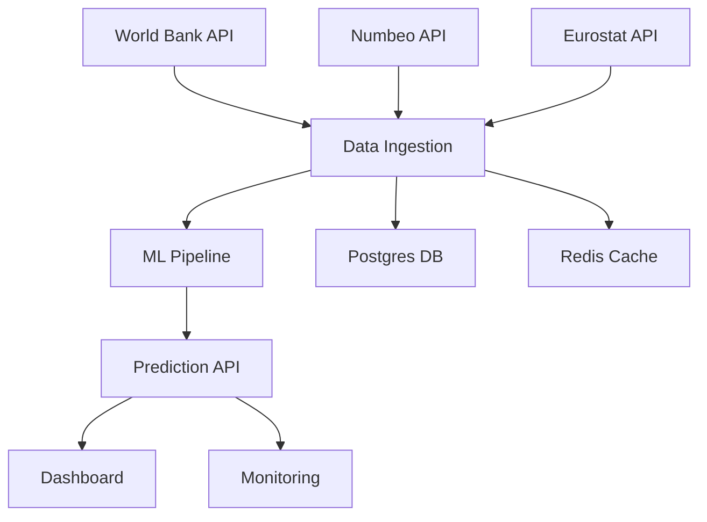

# Poland Living Standards Dashboard (SOTA Edition)


A state-of-the-art, production-grade data science dashboard for Polish cities. Built for data science portfolio showcase.

---

## Features
- Interactive dashboard with real-time data
- Automated data ingestion from World Bank, Numbeo, Eurostat
- Machine learning pipeline for cost of living prediction
- Data validation and error handling
- REST API for predictions
- Docker Compose for local development
- CI/CD pipeline (GitHub Actions)
- Unit and integration tests
- API documentation and examples

---

## Architecture



---

## Quick Start

### Local Development
```bash
# Start all services
docker-compose up --build
# Access dashboard at http://localhost:3002
```

### Run Tests
```bash
npm test
```

---

## API Endpoints
| Endpoint                | Method | Description                  |
|------------------------|--------|------------------------------|
| /api/poland-gdp        | GET    | Poland GDP per capita        |
| /api/predict           | POST   | ML prediction for a city     |
| /api/cities            | GET    | List of cities               |
| /health                | GET    | Pipeline health/status       |

---

## ML Pipeline & Monitoring
- Automated feature engineering and model training
- Hyperparameter tuning (Optuna)
- Model validation and explainability (SHAP)
- Monitoring endpoint `/health` provides pipeline status
- Errors and anomalies are logged and reported

---

## Testing Strategy
- Unit tests for core logic
- Integration tests for API endpoints
- Data validation tests
- CI/CD runs all tests on every push

---

## Deployment
- Docker Compose for local and cloud deployment
- GitHub Actions for CI/CD
- Ready for cloud migration (AWS/GCP/Azure)

---

## Portfolio Value
This project demonstrates:
- Modern data science and MLOps practices
- Automated testing and deployment
- Robust error handling and monitoring
- Clean, documented codebase

---

## License
MIT