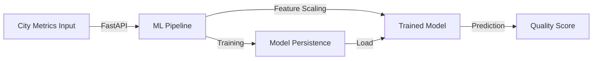

# Quality of Life Prediction API


Production-ready ML API for predicting city quality of life scores using ensemble models.

---

## 🎯 Overview

This project demonstrates **end-to-end ML pipeline development** with:

- **Feature Engineering** - City metrics (cost of living, safety, healthcare, etc.)
- **Model Training** - RandomForest and GradientBoosting regressors
- **Model Serving** - FastAPI REST API with automatic model retraining
- **Model Persistence** - Joblib serialization with metadata
- **Comprehensive Testing** - Unit and integration tests

---

## 🏗️ Architecture



---

## 🚀 Quick Start

### Installation

```bash
cd data_science_1
pip install -r requirements.txt
```

### Train Model

```bash
# Train model with synthetic data
python -m src.ml_pipeline

# Or via API
curl -X POST "http://localhost:8080/train" \
  -H "Content-Type: application/json" \
  -d '{"n_samples": 500, "model_type": "random_forest"}'
```

### Run API Server

```bash
# Start FastAPI server
python -m src.app

# Or with uvicorn
uvicorn src.app:app --reload --port 8080
```

### Make Predictions

```bash
# Single prediction
curl -X POST "http://localhost:8080/predict" \
  -H "Content-Type: application/json" \
  -d '{
    "cost_of_living_index": 75.5,
    "rent_index": 45.2,
    "safety_index": 68.3,
    "health_care_index": 72.1,
    "pollution_index": 35.8,
    "climate_index": 80.0,
    "traffic_time_index": 55.4,
    "purchasing_power_index": 85.2
  }'
```

---

## 📡 API Endpoints

| Endpoint | Method | Description |
|----------|--------|-------------|
| `/` | GET | API information |
| `/health` | GET | Health check + model status |
| `/predict` | POST | Single prediction |
| `/predict/batch` | POST | Batch predictions |
| `/train` | POST | Train/retrain model |
| `/features/importance` | GET | Feature importance scores |
| `/model/info` | GET | Model metadata |
| `/docs` | GET | Interactive API documentation |

---

## 🧠 ML Pipeline Features

### Data Generation
- Synthetic city data with realistic correlations
- 8 input features (cost, safety, healthcare, etc.)
- Target: Quality of life score (0-100)

### Models
- **Random Forest Regressor** (default)
  - 100 trees, max_depth=10
  - Feature importance available
  
- **Gradient Boosting Regressor**
  - 100 estimators, learning_rate=0.1
  - Better for non-linear relationships

### Preprocessing
- StandardScaler for feature normalization
- Automatic feature engineering
- Missing value handling

### Evaluation
- Train/test split (80/20)
- 5-fold cross-validation
- Metrics: R², RMSE, MAE
- Feature importance analysis

---

## 🧪 Testing

```bash
# Run all tests
pytest tests/ -v --cov=src

# Run specific test file
pytest tests/unit/test_ml_pipeline.py -v

# Run with coverage report
pytest tests/ --cov=src --cov-report=html
```

### Test Coverage
- ML pipeline unit tests
- API endpoint tests
- Model training tests
- Prediction tests
- Error handling tests

---

## 📁 Project Structure

```
data_science_1/
├── src/
│   ├── __init__.py
│   ├── app.py                 # FastAPI application
│   └── ml_pipeline.py         # ML pipeline implementation
├── models/
│   └── quality_of_life_model.joblib  # Trained model
├── tests/
│   ├── unit/
│   │   ├── test_ml_pipeline.py
│   │   └── test_app.py
│   └── integration/
│       └── test_api_integration.py
├── requirements.txt
├── pyproject.toml
├── Dockerfile
├── docker-compose.yml
└── README.md
```

---

## 🛠️ Tech Stack

| Technology | Purpose |
|-----------|---------|
| **FastAPI** | REST API framework |
| **scikit-learn** | ML models and preprocessing |
| **Pandas** | Data manipulation |
| **Pydantic** | Data validation |
| **Joblib** | Model serialization |
| **pytest** | Testing framework |

---

## 📈 Model Performance

Typical metrics on synthetic data:

- **R² Score**: ~0.95 (test set)
- **RMSE**: ~3.5 points
- **MAE**: ~2.8 points
- **Cross-validation R²**: 0.94 ± 0.02

### Feature Importance (RandomForest)

1. Safety Index (~25%)
2. Healthcare Index (~20%)
3. Purchasing Power (~15%)
4. Climate Index (~15%)
5. Others (~25%)

---

## 🚀 Deployment

### Local Development

```bash
python -m src.app
```

### Docker

```bash
docker build -t quality-of-life-api .
docker run -p 8080:8080 quality-of-life-api
```

### Docker Compose

```bash
docker-compose up --build
```

---

## 📊 Portfolio Value

This project demonstrates:

✅ **End-to-End ML Pipeline** - From data generation to serving  
✅ **Model Training & Evaluation** - Cross-validation, metrics  
✅ **RESTful API Design** - FastAPI with automatic docs  
✅ **Model Persistence** - Saving/loading trained models  
✅ **Feature Engineering** - Scaling, preprocessing  
✅ **Production Patterns** - Health checks, error handling  
✅ **Testing** - Unit and integration tests  
✅ **Documentation** - Clear API docs and examples

---

## 🎓 Learning Outcomes

- Building production ML APIs
- Implementing regression models
- Feature engineering and preprocessing
- Model evaluation and metrics
- API design with FastAPI
- Model serialization and versioning
- Testing ML systems

---

## 📝 License

MIT

---

## 🔗 Related Projects

- [data_science_2](../data_science_2) - Advanced ML with dashboards
- [data_engineering_2](../data_engineering_2) - Kafka streaming pipeline
- [data_engineering_4](../data_engineering_4) - Spark Streaming

