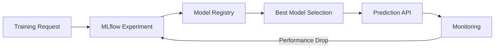

# MLOps Platform


End-to-end MLOps platform demonstrating model lifecycle management, experiment tracking, and monitoring.

---

## 🎯 Overview

Production MLOps platform with:
- **Experiment Tracking** - MLflow integration
- **Model Versioning** - Model registry
- **Automated Training** - API-driven training
- **Model Monitoring** - Performance tracking
- **Model Comparison** - Metric-based selection

---

## 🏗️ Architecture



---

## 🚀 Quick Start

```bash
cd data_science_4
pip install -r requirements.txt

# Start MLflow UI (optional)
mlflow ui

# Start API
python -m src.main
```

Access API at `http://localhost:8084/docs`

---

## 📡 API Endpoints

| Endpoint | Method | Description |
|----------|--------|-------------|
| `/train` | POST | Train new model |
| `/predict` | POST | Make predictions |
| `/models` | GET | List all models |
| `/models/best` | GET | Get best model |
| `/metrics` | GET | Monitoring metrics |
| `/health` | GET | Health check |

---

## 💡 Example Usage

```bash
# Train a model
curl -X POST "http://localhost:8084/train" \
  -H "Content-Type: application/json" \
  -d '{
    "model_type": "random_forest",
    "n_samples": 1000,
    "n_features": 20
  }'

# Make predictions
curl -X POST "http://localhost:8084/predict" \
  -H "Content-Type: application/json" \
  -d '{
    "features": [[1.2, 0.5, -0.3, ...]]
  }'

# Compare models
curl "http://localhost:8084/models"

# Get monitoring metrics
curl "http://localhost:8084/metrics"
```

---

## 🧠 Key Features

### Experiment Tracking
- Automatic parameter logging
- Metric tracking (accuracy, F1, precision, recall)
- Cross-validation scores
- Feature importance

### Model Comparison
- Side-by-side metric comparison
- Best model selection
- Performance trends

### Monitoring
- Prediction logging
- Performance metrics
- Distribution tracking

---

## 🛠️ Tech Stack

- **MLflow** - Experiment tracking & model registry
- **scikit-learn** - ML models
- **FastAPI** - REST API
- **Pandas** - Data manipulation

---

## 📊 Portfolio Value

✅ **HIGHEST HIRING IMPACT**  
✅ **MLOps Expertise** - Experiment tracking, model registry  
✅ **Production Patterns** - Monitoring, versioning  
✅ **Model Lifecycle** - Train → Deploy → Monitor  
✅ **Automated Workflows** - API-driven training  
✅ **Separates from 90% of DS candidates**

---

## 🎓 Skills Demonstrated

- MLOps best practices
- Experiment tracking (MLflow)
- Model versioning
- Performance monitoring
- API-driven ML

---

##📝 License

MIT
